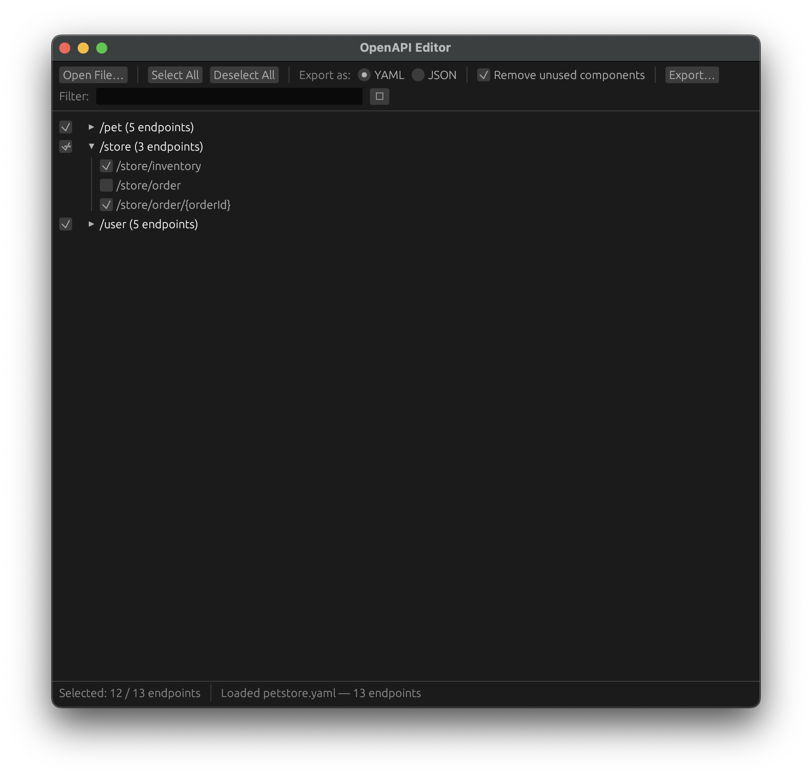

<p align="center">
  
</p>

# openapi-edit

A desktop application for visually filtering OpenAPI specifications. Load a spec (YAML or JSON), select the endpoints you want to keep, and export a trimmed version with only the chosen paths and their referenced components.

Built with [egui](https://github.com/emilk/egui) via [eframe](https://github.com/emilk/egui/tree/master/crates/eframe).

## Features

- Load OpenAPI specs from local files or URLs (with optional HTTP Basic Authentication)
- Endpoints grouped by first path segment with tri-state checkboxes (all/some/none)
- Search/filter bar to quickly find endpoints
- Automatic pruning of unreferenced `#/components/*` entries (schemas, parameters, responses, etc.)
- Export as YAML or JSON
- Persistent selections across sessions -- re-open the same spec and your previous selection is restored
- Headless `--export` mode for CI/scripting using a previously saved selection
- Spec drift detection: warnings when endpoints are added or removed between sessions



## Building

Requires Rust (edition 2024). Install via [rustup](https://rustup.rs/) if needed.

```sh
cargo build --release
```

The binary will be at `target/release/openapi-edit`.

## Usage

### GUI mode

```sh
# Open with file picker
openapi-edit

# Open a local file directly
openapi-edit path/to/spec.yaml

# Open a spec from a URL
openapi-edit https://petstore3.swagger.io/api/v3/openapi.json

# Open a URL behind Basic Authentication
openapi-edit https://example.com/api.yaml --user admin --password secret
```

Use the GUI to select/deselect endpoints, then click **Export** to save the filtered spec. Your selection is automatically remembered for next time.

### Headless export (`--export`)

Re-export a spec using a previously saved selection without opening the GUI:

```sh
openapi-edit path/to/spec.yaml --export filtered.yaml
openapi-edit https://example.com/api.json --export filtered.json

# Use a custom selections database
openapi-edit spec.yaml --export filtered.yaml --db ./my-selections.json
```

The output format is determined by the export file's extension (`.yaml`/`.yml` or `.json`).

If no saved selection exists for the given source, the GUI opens instead so you can make your initial selection.

When the spec has changed since the last export, the CLI prints diagnostics:

- **Warnings** for endpoints that were previously selected or deselected but no longer exist
- **Info** for new endpoints that were automatically included

### Options

```
openapi-edit [INPUT] [--export OUTPUT] [--db PATH] [--user USER --password PASSWORD]

  INPUT              Path or URL to an OpenAPI spec (YAML/JSON)
  --export OUTPUT    Export filtered spec to OUTPUT without opening the GUI
  --db PATH          Use a custom path for the selections database file
  --user USER        Username for HTTP Basic Authentication (URL sources only)
  --password PASSWORD
                     Password for HTTP Basic Authentication (URL sources only)
  -h, --help         Show help
```

## Selection storage

The location can be overridden with the `--db` flag. By default, selections are persisted in a JSON file at:

| Platform | Path                                                                       |
| -------- | -------------------------------------------------------------------------- |
| macOS    | `~/Library/Application Support/openapi-edit/selections.json`               |
| Linux    | `$XDG_CONFIG_HOME/openapi-edit/selections.json` (defaults to `~/.config/`) |
| Windows  | `%APPDATA%\openapi-edit\selections.json`                                   |

## License

MIT
